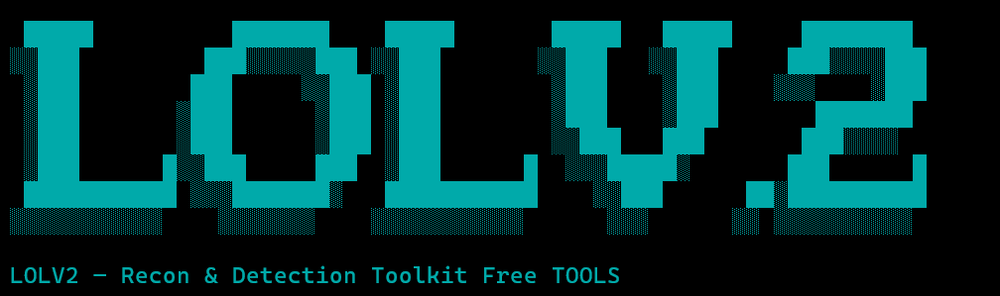
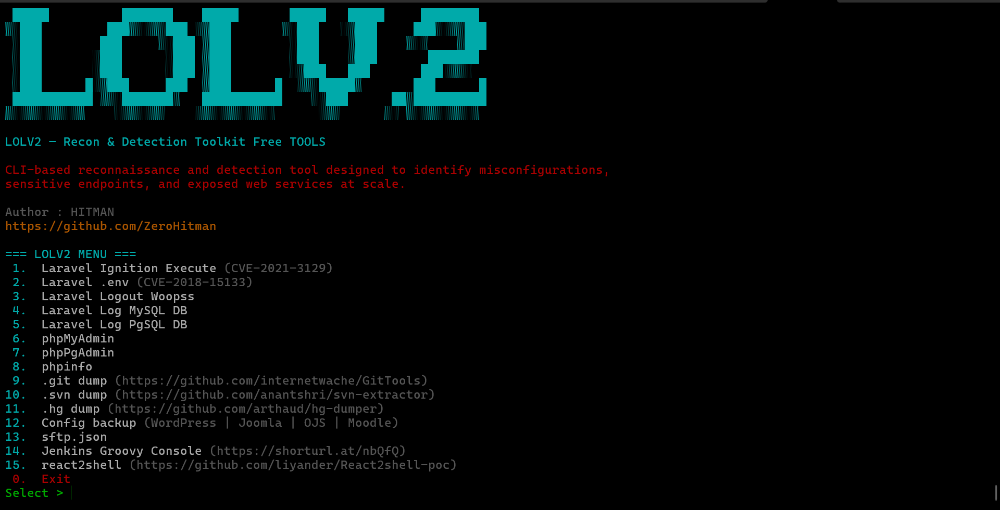

LOLV2 — Recon & Detection Toolkit
================================

🔍 **LOLV2** is a CLI-based reconnaissance and detection toolkit designed to identify  
misconfigurations, sensitive endpoints, and exposed web services **at scale**.

LOLV2 focuses on **visibility and discovery**, not exploitation.

**LOLV2** also uses an external supporting tool:
- **httpx** by ProjectDiscovery (https://github.com/projectdiscovery/httpx)

Proper credit and respect go to the original developer and contributors of httpx.

------------------------------------------------------------

🎯 FOCUS
--------

✔ Recon & Detection  
✖ No exploitation  
✖ No brute-force  
✖ No auto-dump  
✖ No privilege escalation  

Designed for:
- Security reconnaissance
- Exposure assessment
- Pre-exploitation validation
- Blue team & defensive audits

------------------------------------------------------------

⚙️ INSTALLATION
---------------
CHECK REQUIREMENTS
==================

LOLV2 requires Go (Golang) to be installed on the system.
Please verify Go installation before using LOLV2.

------------------------------------------------------------

CHECK GO INSTALLATION
---------------------

Run the following command:

go version

If Go is installed, it will display the installed version.
If not, follow the installation steps below based on your OS.

------------------------------------------------------------

INSTALL GO (GOLANG)
===================

Ubuntu / Debian
---------------
```bash
sudo apt update
sudo apt install -y golang
```
------------------------------------------------------------

CentOS 7 / RHEL 7
-----------------
```bash
sudo yum install -y golang
```
------------------------------------------------------------

CentOS Stream / Rocky Linux / AlmaLinux
---------------------------------------
```bash
sudo dnf install -y golang
```
------------------------------------------------------------

Arch Linux
----------
```bash
sudo pacman -Sy go
```
------------------------------------------------------------

Verify Installation
-------------------
```bash
go version
```
------------------------------------------------------------

NOTE
----

Go is required only for building or extending LOLV2.
Precompiled binaries can be executed without Go installed.

------------------------------------------------------------
📥 Download binary:

```bash
wget https://raw.githubusercontent.com/ZeroHitman/ZeroLOLV2/refs/heads/main/lolv2 -O lolv2
chmod +x lolv2
```

▶ Run:

```bash
./lolv2 -h
```

📌 Optional (system-wide):

```bash
sudo mv lolv2 /usr/local/bin/lolv2
```

------------------------------------------------------------

🚀 USAGE
--------

📂 Scan list of targets:

```bash
lolv2 -l targets.txt
```

🌐 Scan single URL:

```bash
lolv2 -u https://example.com
```

🧩 Verbose mode:

```bash
lolv2 -l targets.txt -v
```

🔄 Update internal httpx engine:

```bash
lolv2 --updateHttpx
```

------------------------------------------------------------

📁 OUTPUT STRUCTURE
------------------

Results are stored **per target list**, following the executing user:

```text
~/result_lolv2/targets.txt/
├── phpinfo.txt
├── phpmyadmin.txt
├── laravel_env.txt
├── jenkins.txt
└── ...
```

Rules:
- 1 menu = 1 output file
- Full URL + metadata preserved
- No alive check performed
- Errors do not interrupt scan flow

------------------------------------------------------------

🧠 DETECTION MODULES
-------------------

• Laravel Ignition Execute  
• Laravel .env exposure  
• Laravel Logout (Whoops)  
• Laravel Log (MySQL)  
• Laravel Log (PostgreSQL)  
• phpMyAdmin  
• phpPgAdmin  
• phpinfo  
• .git directory exposure  
• .svn directory exposure  
• .hg directory exposure  
• CMS configuration backups  
• sftp.json exposure  
• Jenkins Groovy Script Console  
• react2shell (RSC detection)  

Each module:
- Uses signature-based detection
- Executes all rules in one run
- Produces a single output file

------------------------------------------------------------

🖼 SCREENSHOTS
--------------



------------------------------------------------------------

⚠️ DISCLAIMER
-------------

This tool is intended solely for legitimate security testing and educational purposes.  
It is **100% free**. Anyone selling this tool is a fool.

Any misuse, unauthorized scanning, or illegal activity using this tool  
is **the sole responsibility of the user**.

------------------------------------------------------------

👤 AUTHOR
--------

HITMAN  
Recon & Detection Toolkit  
https://github.com/ZeroHitman

------------------------------------------------------------

🛡 Philosophy
-------------

"Visibility first. Exploitation is optional."
